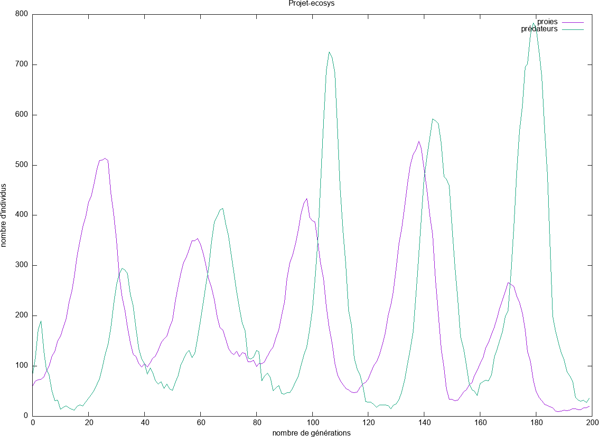

> Nom et prénom : LE Tran Dang Quang
> Numéro d'etudiant : 21107520
> Groupe : 9

# Ecosystème
## Prologue

Ce projet vise à réaliser une simulation simple de l'écosystème, qui consiste principalement à nous faire comprendre mieux les structures et les listes chainées en C.
La simulation aura lieu sur un terrain de dimension 20x50, dont les agents proviennent de 2 types : prédateurs et proies. 

- Au cas où il n'y a qu'un proie dans la case, l'affichage sera '*'
- S'il n'y a qu'un prédateur dans la case, l'affichage deviendra 'O'
- Et si tous les 2 sont dans la même case, l'affichage sera '@'

Ce projet contribue 25% de la note totale de l'UE LU2IN018 - C avancé que propose Sorbonne Université durant le premier semestre en L2 Informatique

## Structure de Animal
### Définition de structure

```C
typedef struct _animal {
  int x;
  int y;
  int dir[2]; /* direction courante sous la forme (dx, dy) */
  float energie;
  struct _animal *suivant;
} Animal;
```

### D'autres variables

```C
//Size de tableaux
#define SIZE_X 20
#define SIZE_Y 50

#define NB_PROIES 20
#define NB_PREDATEURS 20
#define T_WAIT 40000

#define p_ch_dir 0.01
#define p_reproduce_proie 0.4
#define p_reproduce_predateur 0.5
#define temps_repousse_herbe -15
```

### Méthodes

1) Pour créer un animal

    ```C
    Animal *creer_animal(int x, int y, float energie);
    ```

2) Pour ajouter un animal en tête de la liste chainée
    ```C
    Animal *ajouter_en_tete_animal(Animal *liste, Animal *animal);
    ```
    
3) Pour compter le nombre d'animaux dans la liste

- de façon récusive:
    ```C
    unsigned int compte_animal_rec(Animal *la);
    ```
- de façon itérative:
    ```C
    unsigned int compte_animal_it(Animal *la);
    ```

4) Pour ajouter dynamiquement un animal dans la liste

    ```C
    void ajouter_animal(int x, int y, float energie, Animal **liste_animal);
    ```
    
5) Pour enlever un animal de la liste

    ```C
    void enlever_animal(Animal **liste, Animal *animal);
    ```    
    
6) Pour libérer toute la liste

    ```C
    Animal* liberer_liste_animaux(Animal *liste);
    ```
    
7) Pour afficher l'ecosystème

    ```C
    void afficher_ecosys(Animal *liste_proie, Animal *liste_predateur);
    ```
    
8) Pour bouger les animaux dans la liste

    ```C
    void bouger_animaux(Animal *la);
    ```    
    
9) Pour reproduire la liste d'animaux

    ```C
    void reproduce(Animal **liste_animal, float p_reproduce);
    ```
    
10) Pour vérifier s'il y a une proie sur une case donnée

    ```C
    Animal *animal_en_XY(Animal *l, int x, int y);
    ```
    
11) Rafraichissement des animaux
3 étapes principales :

    - Faire bouger les animaux
    - Baisser l'énergie des animaux de 1 (sauf s'il y a des herbes au même coordonnée qu'animal, son énergie cumule une même quantité que celle des herbes, et on initialise la quantité des herbes à temp_repousse_herbe)
    - faire reproduire les animaux
    
    a) Pour les proies
    
    ```C
    void rafraichir_proies(Animal **liste_proie, int monde[SIZE_X][SIZE_Y]) ;
    ```
    
    b) Pour les prédateurs
    
    ```C
    void rafraichir_predateurs(Animal **liste_predateur, Animal **liste_proie);
    ```    
    
    c) Pour les herbres
    
    ```C
    void rafraichir_monde(int monde[SIZE_X][SIZE_Y]);
    ```    
    
12) Pour gérer des fichiers

- Écriture des fichiers :
    
    ```C
    void ecrire_ecosys(const char *nom_fichier, Animal *liste_proie, Animal *liste_preda);
    ```
    
- Lire des fichiers : 
    
    ```C
    void lire_ecosys(const char *nom_ficher, Animal **liste_proie, Animal **liste_preda);
    ```    
    
### Représentation Graphe

Graphiques de l'évolution des populations se sont affichés en GnuPlot:



    
## Remerciant

Je suis vraiment ému quand les professeurs m'ont donné ce projet spécial. Grâce à ce projet, je peux étudier plus de choses de ce projet là. Je vous remercie en tout cas 


